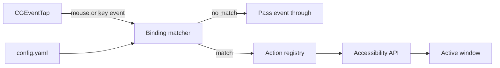
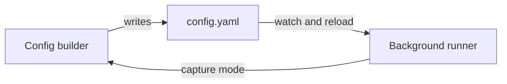

# Window Manager — Plan

Goal: replace the BetterTouchTool tiling setup with a small Python app. A mouse button or a
keyboard shortcut triggers a tiling action on the active window.

Status: built. First set of actions, config wizard and packaging are in place.
See [README.md](README.md) for usage.

## Answer to the core question

Yes. macOS exposes everything needed through public frameworks:

| Need | Framework | Python access |
|---|---|---|
| Read mouse and key events | Quartz `CGEventTap` | `pyobjc-framework-Quartz` |
| Move and resize windows | Accessibility (`AXUIElement`) | `pyobjc-framework-ApplicationServices` |
| Display geometry | `NSScreen` | `pyobjc-framework-Cocoa` |

The app runs as a background agent with a `CFRunLoop`. No window of its own.

## Architecture



## Modules

| Module | Responsibility |
|---|---|
| `input/tap.py` | Event tap. Emits normalised trigger objects. |
| `input/keys.py` | Keycode table, including F13–F20. Modifier flags. |
| `bindings.py` | Loads config. Maps trigger to action name plus args. |
| `actions/registry.py` | Decorator-based registry. New actions need no core change. |
| `actions/tiling.py` | maximise, left half, right half, move to next display. |
| `actions/keyboard.py` | Post a synthetic key press. |
| `window.py` | Read and write frame of the focused window. |
| `screens.py` | Screen list, visible frames, screen of a window. |
| `app.py` | Entry point. Permission check, run loop, signal handling. |
| `cli.py` | Config wizard. Capture mode, action picker, validated write. |
| `watch.py` | Config file polling. Reload without a restart. |
| `geometry.py` | Frame arithmetic. Pure. |
| `permissions.py` | Accessibility and Input Monitoring checks. |

Functional style: tiling actions are pure `(Frame, Screen) -> Frame` functions. Only `window.py`
and `actions/keyboard.py` perform side effects.

## Input mapping

A trigger is a mouse button or a key combination. Both feed the same matcher, and both reach the
same action registry. There is no key-remapping middle step.

Mouse buttons arrive as `otherMouseDown` with a button number. Button 3 and up are the side
buttons. The tap can swallow the event so the original click does not reach the app below.

F13–F20 keycodes: 105, 107, 113, 106, 64, 79, 80, 90.

Sending a key press stays available as an action (`send_key`), not as a mapping layer. Use it to
drive other apps from a mouse button.

## Config draft

```yaml
bindings:
  - trigger: {type: mouse, button: 3}
    action: maximise
  - trigger: {type: mouse, button: 4}
    action: half
    args: {side: left}
  - trigger: {type: key, key: F13, mods: [ctrl, alt]}
    action: half
    args: {side: right}
  - trigger: {type: key, key: F14}
    action: move_display
    args: {direction: right}
  - trigger: {type: mouse, button: 5}
    action: send_key
    args: {key: F13, mods: [cmd, shift]}
```

## Actions — first set

| Name | Args | Result |
|---|---|---|
| `maximise` | — | Window fills the visible frame of its screen. |
| `half` | `side: left \| right` | Window fills half the visible frame. |
| `move_display` | `direction: left \| right` | Window moves to the next screen, frame scaled. |
| `send_key` | `key`, `mods` | Posts a synthetic key press to the focused app. |

`send_key` is not window management. It lives in `actions/keyboard.py` and uses
`CGEventCreateKeyboardEvent`. It proves the registry accepts unrelated action types.

Later additions: quarters, thirds, centre, grow and shrink, cycle through sizes on repeat press.

## Permissions

The app needs two grants in System Settings → Privacy & Security:

- **Accessibility** — to move windows.
- **Input Monitoring** — to read the event tap.

Grants attach to the signed binary. Grant them to a packaged `.app`, not to the terminal.
Expect to re-grant after each rebuild during development.

## Packaging

- Development: `.venv` at project root, deps pinned in `requirements.txt`.
- Distribution: `py2app` produces a `.app` bundle with `LSUIElement=1`, so no Dock icon.
  `PyInstaller` is the fallback if `py2app` fights the pyobjc bundle.
- Autostart: a `launchd` plist in `~/Library/LaunchAgents`.

## Future — config builder

`config.yaml` stays the source of truth. The builder is a separate front end that writes that
file. The background runner never depends on the builder.



Scope:

- Capture mode: press a button or key, the builder records the trigger. No keycode lookup by hand.
- Pick an action from the registry, fill its args from the action signature.
- Validate on save: no duplicate triggers, no unknown actions.
- Runner watches the file and reloads bindings. No restart.

Form, in order of effort:

1. CLI wizard — `window-manager bind`. Reuses the existing event tap for capture.
2. Menu bar app — `rumps`, listing bindings with an add and remove flow.
3. Full window — only if the menu bar becomes cramped.

Start with the CLI wizard. It needs no extra dependency.

## Answered questions

| Question | Answer |
|---|---|
| Swallow the mouse button, or pass it through? | Swallow by default. `swallow: false` per binding passes it on. The tap also hides the matching mouse-up. |
| Does `send_key` need a re-entry guard? | Yes. Posted events carry a marker in `kCGEventSourceUserData`. The tap skips them. |
| Which mouse buttons does the device report? | Run `make run` and press each button. Debug mode logs every trigger. |
| Should `move_display` keep the relative frame? | Relative by default. `keep: size` and `keep: maximise` cover the other two. |
| Menu bar icon, or CLI only? | CLI only. A `rumps` menu bar app stays open as a later addition. |

macOS stamps an `fn` flag on every function key press, so the matcher ignores that bit.
Without this, a bare `f13` binding never fires.

## Done

1. `.venv` with pyobjc, event tap reads mouse buttons and keys.
2. `maximise` works end to end through the accessibility API.
3. Config loader, validation and the action registry.
4. First set of actions: `maximise`, `half`, `move_display`, `send_key`.
5. `py2app` bundle with `LSUIElement=1` and a `launchd` plist.
6. File watching with reload, and the `bind` config wizard.

## Next steps

1. Add the later layouts: quarters, thirds, centre, grow and shrink.
3. Cycle through sizes on a repeated press of the same trigger.
4. Menu bar app, if the CLI becomes cramped.
