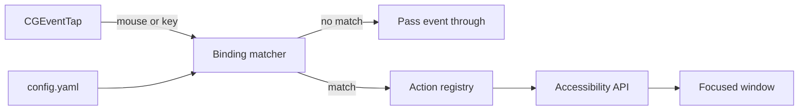

# Window Manager

Mouse and keyboard driven window tiling for macOS. A background agent reads an event tap,
matches the event against a config file, and moves the focused window through the
accessibility API. It replaces a BetterTouchTool tiling setup.

## Flow



## Install

```bash
make venv          # .venv at the project root, deps from requirements.txt
make test
cp config.example.yaml ~/.config/window-manager/config.yaml
```

## Permissions

The agent needs two grants in System Settings → Privacy & Security:

- **Accessibility** — to move windows.
- **Input Monitoring** — to read the event tap.

Grants attach to the signed binary. During development the binary is the terminal that runs
`make run`. For daily use, grant them to `WindowManager.app`. Expect to re-grant after a rebuild.

```bash
make check         # reports both grants and prints the loaded bindings
```

## Run

```bash
.venv/bin/python -m window_manager.app run   # foreground, quiet
make run                                     # foreground, --debug
```

`--debug` logs every key and button the tap sees, including text you type into other apps.
Use it to find a mouse button number, then stop it. Do not leave it running.

The agent watches the config file and reloads on change. A broken config keeps the old bindings.

## Config

`~/.config/window-manager/config.yaml`. Override the path with `--config` or
`WINDOW_MANAGER_CONFIG`.

```yaml
bindings:
  - trigger: {type: mouse, button: 3}
    action: maximise
  - trigger: {type: key, key: f13, mods: [ctrl, alt]}
    action: half
    args: {side: right}
```

| Field | Values |
|---|---|
| `trigger.type` | `mouse` or `key` |
| `trigger.button` | button number — 3 and up are the side buttons |
| `trigger.key` | key name, e.g. `f13`, `left`, `space` |
| `trigger.mods` | `shift`, `ctrl`, `alt`, `cmd` |
| `swallow` | `true` (default) hides the event from the app below |

Modifiers match exactly. A binding on `f13` does not fire for `shift+f13`.

macOS stamps an `fn` flag on every function key press, so the matcher ignores that bit.
`f13` matches whether or not the keyboard reports `fn`.

## Actions

| Name | Args | Result |
|---|---|---|
| `maximise` | — | Window fills the visible frame of its screen. |
| `half` | `side: left \| right \| top \| bottom` | Window fills half the visible frame. |
| `move_display` | `direction: left \| right`, `keep: relative \| size \| maximise` | Window moves to the next screen. |
| `send_key` | `key`, `mods` | Posts a synthetic key press to the focused app. |

```bash
.venv/bin/python -m window_manager.app actions   # names and argument defaults
```

## Add a binding without editing YAML

```bash
.venv/bin/python -m window_manager.app bind
```

The wizard captures the next button or key press, asks for an action and its arguments,
validates the result, and writes the file. The running agent reloads on its own.

## Add an action

Register a function. No core change is needed.

```python
# window_manager/actions/tiling.py
@action("centre")
def centre() -> bool:
    return _apply(lambda frame, screen: fraction(screen.visible, 0.25, 0.25, 0.5, 0.5))
```

Keep the layout pure — `(Frame, Screen) -> Frame` — and let `_apply` do the side effects.

## Package and autostart

```bash
make app             # dist/WindowManager.app, LSUIElement=1, no Dock icon
cp -r dist/WindowManager.app /Applications/
make install-agent   # launchd plist in ~/Library/LaunchAgents
```

`make uninstall-agent` removes it. Logs go to `/tmp/window-manager.log`.

## Layout

| Module | Responsibility |
|---|---|
| `input/tap.py` | Event tap. Emits Trigger objects. Re-enables itself after a timeout. |
| `input/keys.py` | Key names, keycodes, modifier flags. |
| `bindings.py` | Loads and validates the config. Maps a trigger to an action. |
| `actions/registry.py` | Decorator registry. Reads action signatures for the wizard. |
| `actions/tiling.py` | Pure layouts plus their registered wrappers. |
| `actions/keyboard.py` | Synthetic key presses, stamped so the tap ignores them. |
| `window.py` | Focused window frame, read and write. |
| `screens.py` | Screen list in accessibility coordinates. |
| `geometry.py` | Frame arithmetic. Pure. |
| `watch.py` | Config file polling and reload. |
| `app.py` / `cli.py` | Entry point and config wizard. |

## Coordinates

`NSScreen` uses a bottom-left origin. The accessibility API uses a top-left origin on the
primary display. `screens.py` converts once, so every frame elsewhere is top-left.
